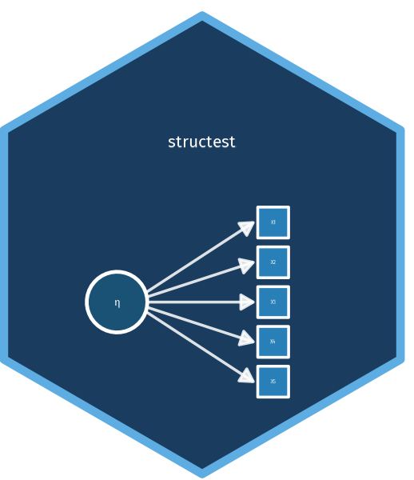

# structest 

[](https://github.com/felipelfv/structest/actions/workflows/R-CMD-check.yaml)
[](https://github.com/felipelfv/structest/actions/workflows/test-coverage.yaml)
[](https://codecov.io/gh/felipelfv/structest)
[](https://lifecycle.r-lib.org/articles/stages.html#experimental)

R package implementing the statistical tests from:

> VanderWeele, T. J. & Vansteelandt, S. (2022). A statistical test to reject the structural interpretation of a latent factor model. *Journal of the Royal Statistical Society: Series B (Statistical Methodology)*, 84, 1063--1089. [doi:10.1111/rssb.12555](https://doi.org/10.1111/rssb.12555)

## Background

Factor analysis is routinely used to assess whether a single univariate latent variable explains the covariance among a set of observed indicators. When a one-factor model fits adequately, researchers typically form a composite score (e.g. the mean of the items) and treat it as a measure of the underlying construct in subsequent causal analyses. This practice implicitly assumes a **structural** interpretation of the latent factor model: that it is the latent variable, rather than the individual indicators, that is causally efficacious.

However, a basic measurement model fitting well does **not** imply the structural interpretation is correct. The individual indicators could each have separate causal effects on outcomes, even though their covariance structure is consistent with a single latent factor (see Figures 2 and 3 in the paper).

VanderWeele and Vansteelandt (2022) show that the structural interpretation imposes testable empirical constraints. Specifically, under a structural latent factor model, the association between any external variable *Z* and indicator *X_i*, scaled by the reliability of *X_i*, must be the same across all indicators (Theorem 1). This package implements two GMM-based tests that exploit these constraints:

- **T0**: a test that depends on estimated reliability coefficients (Section 3.2)
- **T1**: a test that is independent of reliability estimates (Section 3.3)

## Installation

```r
# Install from GitHub
devtools::install_github("felipelfv/structest")
```

## Functions

| Function | Description |
|---|---|
| `test_t0(X, z)` | Reliability-dependent test (Section 3.2). Requires d >= 3 indicators and p >= 2 Z-levels. |
| `test_t1(X, z)` | Reliability-independent test (Section 3.3). Requires d >= 3 indicators and p >= 3 Z-levels. |
| `estimate_reliability(X)` | Estimate reliability coefficients via quasi-Poisson GLM (Section 3.1). |

## Usage

### T0 test (reliability-dependent)

The T0 test uses estimated reliabilities to construct moment conditions that should hold under the structural interpretation. It requires at least 3 indicators and a discrete auxiliary variable *Z* with at least 2 levels.

Under the null hypothesis that the structural model holds, the test statistic follows a chi-squared distribution with (d - 1)(p - 1) degrees of freedom.

```r
library(structest)

set.seed(42)
n <- 5000
d <- 5

# Simulate data under the structural model
z <- rbinom(n, 1, 0.5)                         # binary auxiliary variable
Y <- 1 + 0.5 * z + rnorm(n)                    # latent factor affected by Z
lambda <- c(1.0, 0.8, 0.6, 0.9, 0.7)          # reliabilities
X <- matrix(NA, n, d)
for (i in 1:d) {
  X[, i] <- 2 + lambda[i] * Y + rnorm(n, sd = 0.5)
}

# Run T0 test (should NOT reject)
test_t0(X, z)
```

```r
# Now simulate data where Z affects indicators differently (violating the structural model)
set.seed(42)
Y <- rnorm(n)
X_bad <- cbind(
  2 + 1.0 * Y + 0.5 * z + rnorm(n, sd = 0.3),
  3 + 0.8 * Y + 2.0 * z + rnorm(n, sd = 0.3),   # disproportionate Z effect
  1 + 0.6 * Y - 0.3 * z + rnorm(n, sd = 0.3),
  2 + 0.9 * Y + 0.4 * z + rnorm(n, sd = 0.3),
  1 + 0.7 * Y + 0.8 * z + rnorm(n, sd = 0.3)
)

# Run T0 test (should reject)
test_t0(X_bad, z)
```

### T1 test (reliability-independent)

The T1 test avoids estimating reliabilities entirely by parameterising the conditional expectations as E(X_i | Z = z_j) = gamma_i + alpha_i * beta_j, with alpha_1 = 1 and beta_1 = 0 for identification (Equation 3 in the paper). Under the structural model, the matrix of mean differences Delta_ij = E(X_i | Z = z_j) - E(X_i | Z = z_1) has rank <= 1. The T1 test checks this rank constraint using a two-step efficient GMM procedure. This test requires at least 3 indicators and at least 3 levels of *Z*.

Under the null, the test statistic follows a chi-squared distribution with (d - 1)(p - 2) degrees of freedom.

```r
set.seed(42)
n <- 5000
d <- 5

# Simulate data under the structural model (Z with 4 levels)
z <- sample(0:3, n, replace = TRUE)
Y <- 1 + 0.3 * (z == 1) + 0.7 * (z == 2) + 1.2 * (z == 3) + rnorm(n)
lambda <- c(1.0, 0.8, 0.6, 0.9, 0.7)
X <- matrix(NA, n, d)
for (i in 1:d) {
  X[, i] <- lambda[i] * Y + rnorm(n, sd = 0.5)
}

# Run T1 test (should NOT reject)
test_t1(X, z)
```

### Estimating reliabilities

The reliability coefficients can also be estimated directly. Under the model X_i = lambda_i * Y + epsilon_i, we have Cov(X_i, X_j) = lambda_i * lambda_j. The reliabilities are obtained by fitting a quasi-Poisson GLM with log link to the pairwise covariances.

```r
rel <- estimate_reliability(X)
rel$lambda
```

## Details

### Model

The basic (reflective) latent factor model assumes:

X_i = alpha_i + lambda_i * eta + epsilon_i,  for i = 1, ..., d

where eta is the latent variable, lambda_i are the factor loadings (reliabilities), and epsilon_i are independent error terms. The **structural** interpretation further assumes that eta, rather than the individual X_i, is causally efficacious.

### Theorem 1 (VanderWeele & Vansteelandt, 2022)

If the structural latent factor model holds and *Z* is independent of (X_1, ..., X_d) conditional on eta, then for any *i*, *j*, and any values *z*, *z\**:

lambda_i {E(X_j | Z = z) - E(X_j | Z = z*)} = lambda_j {E(X_i | Z = z) - E(X_i | Z = z*)}

This identity is testable with observed data. The T0 and T1 tests are GMM-based tests of overidentifying restrictions implied by this identity.

### T0 test

Parameterises E(X_i | Z = z) = gamma_i + (lambda_i / lambda_1) * beta_z and tests the overidentifying restrictions using a GMM criterion. The variance of the estimating equations is adjusted for uncertainty in the estimated reliabilities (see paper, p. 2041).

- Degrees of freedom: (d - 1)(p - 1)
- Requires: d >= 3 indicators, p >= 2 Z-levels

### T1 test

Parameterises E(X_i | Z = z_j) = gamma_i + alpha_i * beta_j with alpha_1 = 1 (identification) and beta_1 = 0 (reference level). Tests whether the mean-difference matrix Delta_ij = E(X_i | Z = z_j) - E(X_i | Z = z_1) has rank <= 1, which is the testable implication of the structural model (Equation 3 in the paper). Uses a two-step efficient GMM procedure.

- Degrees of freedom: (d - 1)(p - 2)
- Requires: d >= 3 indicators, p >= 3 Z-levels

### Choosing between T0 and T1

| | T0 | T1 |
|---|---|---|
| **Relies on reliability estimates** | Yes | No |
| **Sensitive to error distribution misspecification** | Yes | No |
| **Minimum Z-levels** | 2 | 3 |
| **Degrees of freedom** | (d-1)(p-1) | (d-1)(p-2) |

The T1 test is generally preferred because it does not depend on the distributional assumptions needed to estimate reliabilities (e.g. independent, homoscedastic errors). However, when only 2 levels of *Z* are available, only the T0 test can be used.

## Reference

VanderWeele, T. J. & Vansteelandt, S. (2022). A statistical test to reject the structural interpretation of a latent factor model. *Journal of the Royal Statistical Society: Series B*, 84, 1063--1089. [doi:10.1111/rssb.12555](https://doi.org/10.1111/rssb.12555)
